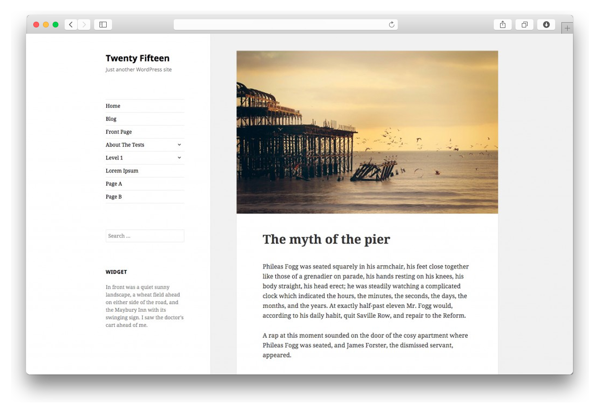

# Resume Skeleton for Grav



Resume by [Fernando Báez](https://www.behance.net/gallery/FREE-Resume-Template/15677411) is a Grav implementation of free PSD resume theme.

# Features

* Extraordinary resume theme, designed by [Fernando Báez](https://www.behance.net/gallery/FREE-Resume-Template/15677411)
* Based on Foundation framework
* Two-Column approach
* Specialities layout with custom icons and descriptions
* Design Skills layout with percentage grid
* Language Skills layout with automatic pie charts
* Education history special layout
* Experience layout
* Recognitions layout with SVG ribbon
* Hobbies & Interests layout with custom icons and descriptions
* Foundation Icon Fonts 3 (around 283 icons included)
* Animate.css support in layouts. You can animate each separate element.
* Fully responsive. Designed with mobile first approach.

## Basic Setup for a new Grav site

The simplest way to install Resume theme for Grav is to download and install the Resume Skeleton package:

1. [Download Resume Skeleton](http://getgrav.org/downloads/skeletons#extras)
2. Simply unzip the package into your web root folder.
3. Point your browser at the folder, job done!

**TIP:** Check out the [general Grav installation instructions](http://learn.getgrav.org/basics/installation) for more details on this process.

---

## Existing Grav site

It is possible to install just the theme, but page content will need to reference the [Resume theme](https://github.com/getgrav/grav-theme-resume)'s supported templates.  It is strongly advised to at least install the Resume Skeleton package to see the theme's capabilities in action.

To install  **just** the theme:

```
$ bin/gpm install resume
```

# Layouts Configuration

Resume theme includes few creative layout templates. This layouts will help you to create perfect resume and to find a dream job :) Below, is a brief description of most important layouts, it's options and values. 

## Header

Header settings are located inside your [skeleton](https://github.com/getgrav/grav-skeleton-resume-site) in  **config/site.yaml**. This file contains your basic contact informations. This content will be displayed in theme header. 

## Specialities

Specialities layout is designed to showcase your most important talents. It contains large icon inside ellipse and description. Example of specialities layout is located inside your [skeleton](https://github.com/getgrav/grav-skeleton-resume-site) in **pages/left/my-specialities/special.md**. 

```markdown
- icon: lightbulb
  text: Logo Design
  animation: fadeInDown
```

* **icon** - select icon from around 300 included font icons. Icon list is available [here](http://zurb.com/playground/foundation-icon-fonts-3).
* **text** - description of your speciality.
* **animation** - you can animate each element. Check available animations [here](https://daneden.github.io/animate.css/).

## Skills

Skills layout is designed to showcase your most important skills. To check example page, go to [skeleton](https://github.com/getgrav/grav-skeleton-resume-site) and open: **pages/left/design-skills/skills.md**. 

```markdown
- name: Adobe Photoshop
  level: 8
```
* **name** - your skill name
* **level** - skill level from 1-8. For example if you specify **5** that means theme will display 5 dark circles and 3 circles will be greyed out. 


## Language skills - pie charts
Language skills layout was made to easily display percentage data like language skills and other.
Example language skills page is located in [skeleton](https://github.com/getgrav/grav-skeleton-resume-site), in: **pages/left/language-skills/langskills.md**. 

```markdown
- name: Spanish
  level_name: Mother Language
  level: 100
```
* **name** - your pie chart name 
* **level_name** - pie chart description
* **level** - percentage to display, ie: if you set that field to 50 then half of pie chart will be dark and half greyed out.
* **animation** - you can animate each element. Check available animations [here](https://daneden.github.io/animate.css/).

## Education
This layout is designed to present your education history. Example page is located in [skeleton](https://github.com/getgrav/grav-skeleton-resume-site), in: **pages/right/education/education.md**

```markdown
- date: From September 2010 to September 2013.
  topic: Industrial Design.
  school: Universidad Antonio de Nebrija. Madrid.
```

* **date** - describe time when you were studying
* **topic** - provide description of your education
* **school** - provide place of your education

## Experience

Experience layout is designed to showcase your work experience. It's created with two columns approach. One for year, one for description. Example page is located in [skeleton](https://github.com/getgrav/grav-skeleton-resume-site), in: **pages/right/experience/experience.md**

```markdown
- date: From 2013 to 2014
  role: Art Director.
  company: Distrito 01 (d01 .es)
  years: 2
  animation: fadeIn
``` 
* **date** - provide date
* **role** - your role in company
* **company** - company 
* **years** - years to showcase in first column with enlarged font
* **animation** - you can animate each element. Check available animations [here](https://daneden.github.io/animate.css/).

## Recognitions

Recognitions layout is designed to showcase your awards and recognitions. On left there is SVG ribbon with achieved place and amount of finalists. On the right, informations about contest. Example page is located in [skeleton](https://github.com/getgrav/grav-skeleton-resume-site), in: **pages/right/recognitions/recognitions.md**

```markdown
- title: Remus Logo Design.
  desc: Internal contest. One of the three finalists.
  place: Universidad Antonio de Nebrija. Madrid
  position: 1-3
  animation: fadeIn
```    
* **title** - contest title
* **desc** - contest description
* **place** - place where contest took place
* **position** - achieved position
* **animation** - you can animate each element. Check available animations [here](https://daneden.github.io/animate.css/).

## Hobbies and Interests

Interests layout is designed to show your hobbies and interests. It's approach is simple. Circle with icon and description. Example page is located in [skeleton](https://github.com/getgrav/grav-skeleton-resume-site), in: **pages/right/hobbies-and-interests/interests.md**

```markdown
- icon: camera
  activity: Photography
  animation: fadeIn
```

* **icon** - select icon from around 300 bundled font icons. List is available  [here](http://zurb.com/playground/foundation-icon-fonts-3).
* **activity** - icon description
* **animation** - you can animate each element. Check available animations [here](https://daneden.github.io/animate.css/).

## Footer
Footer and it's content is located inside **partials** directory. File name is **footer.html.twig**.

